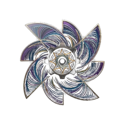

<!-- Don't delete it -->
<div name="readme-top"></div>

<!-- Organization Logo -->
<div align="center" style="display: flex; align-items: center; justify-content: center; gap: 16px;">
  
  
</div>

&nbsp;

<div align="center">

[](https://github.com/StabilityNexus/Windmill-EVM-WebUI)

</div>

<!-- Organization/Project Social Handles -->
<p align="center">
<!-- Telegram -->
<a href="https://t.me/StabilityNexus">
</a>
&nbsp;&nbsp;
<!-- X (formerly Twitter) -->
<a href="https://x.com/StabilityNexus">
</a>
&nbsp;&nbsp;
<!-- Discord -->
<a href="https://discord.gg/YzDKeEfWtS">
</a>
&nbsp;&nbsp;
<!-- OpenSSF Scorecard -->
<a href="https://securityscorecards.dev/viewer/?uri=github.com/StabilityNexus/Windmill-EVM-WebUI">
</a>
</p>

---

<div align="center">
<h1>Windmill Exchange</h1>
</div>

**Windmill Exchange** is a decentralized on-chain order matching engine with configurable dynamic pricing curves and autonomous keeper matching. It brings an auction-house model to EVM chains, where buy and sell orders are continuously matched by keeper bots rather than by a central limit order book.

---

## 🚀 Features

- **Auction-based matching**: buy and sell orders are matched continuously by keepers, not through a traditional order book.
- **Dynamic pricing curves**: configurable price curves (`PriceCurve.sol`) adapt to market conditions for each trading pair.
- **Autonomous keeps**: an off-chain keeper bot monitors protocol state and executes settlement transactions safely (`DRY_RUN` and confirmation controls included).
- **Multi-network support**: Ethereum, Polygon, Base, BNB Smart Chain and more.
- **Wallet-first UI**: connects to MetaMask and other Web3 wallets, with in-app network switching.
- **Live statistics**: real-time stats and market views powered by an indexed subgraph.
- **Transparent infrastructure**: every match, fill and repricing event is settled on-chain and verifiable in the explorer.

---

## 🛠️ Tech Stack

| Layer | Technology |
|---|---|
| Frontend | Next.js (App Router), React, TypeScript |
| Styling | Tailwind CSS |
| UI Components | Custom glassmorphism components + shadcn-style primitives |
| Blockchain | Wagmi, Ethers.js, Web3 wallets (MetaMask, WalletConnect, etc.) |
| Smart Contracts | [Windmill-EVM-Contracts](https://github.com/StabilityNexus/Windmill-EVM-Contracts) (Solidity + Foundry) |
| Keepers | [Windmill-EVM-Keeper](https://github.com/StabilityNexus/Windmill-EVM-Keeper) (Node.js + Ethers.js) |
| Indexing | The Graph subgraph (`subgraph/`) |

---

## ▶️ Getting Started

### Prerequisites

- **Node.js 20+** and npm
- A Web3 wallet (e.g. MetaMask) to connect

### Installation

```bash
# 1. Clone the repository
git clone https://github.com/StabilityNexus/Windmill-EVM-WebUI.git
cd Windmill-EVM-WebUI

# 2. Install dependencies
npm install
```

### Run the development server

```bash
npm run dev
```

Open [http://localhost:3000](http://localhost:3000) in your browser.

### Build, lint and type-check

```bash
npm run build      # production build
npm run lint       # ESLint
npx tsc --noEmit   # TypeScript type-check
```

### Test

```bash
# This repo is a frontend; end-to-end checks run through build + lint.
# Contract logic tests live in Windmill-EVM-Contracts (forge test).
```

---

## 📁 Project Structure

```text
.
├── app/                    # Next.js App Router pages + metadata
│   ├── dashboard/          # Connected-user dashboard
│   ├── how-it-works/       # Protocol explainer
│   ├── stats/              # Live protocol statistics
│   ├── keepers/            # Keeper network overview
│   ├── support/            # Help & support
│   ├── docs/               # Documentation
│   ├── layout.tsx          # Root layout (metadata, theme, fonts)
│   └── globals.css         # Global design system
├── components/
│   ├── layout/             # Navbar, Footer
│   └── landing/            # Landing sections
├── context/                # Wallet provider (Wagmi)
├── hooks/                  # Shared React hooks
├── lib/                    # Utilities and helpers
├── types/                  # Shared TypeScript types
├── subgraph/               # The Graph indexing definitions
├── public/                 # Static assets and logos
├── brand/                  # Project branding assets (logo, palette, typography)
└── next.config.ts          # Next.js configuration
```

---

## 🤝 Contributing

We welcome contributions of all kinds! Please read our [CONTRIBUTING.md](CONTRIBUTING.md) first — it explains the mandatory Discord workflow and our AI-use disclosure policy.

---

## 🌐 Deployment

The repo ships with a GitHub Actions workflow (`.github/workflows/nextjs.yml`) that builds and deploys the static export to **GitHub Pages** on every push to `main`.

---

## 🙌 Thanks to All Contributors

Thanks for spending your time helping Windmill Exchange grow. Keep rocking!

[](https://github.com/StabilityNexus/Windmill-EVM-WebUI/graphs/contributors)

© Stability Nexus